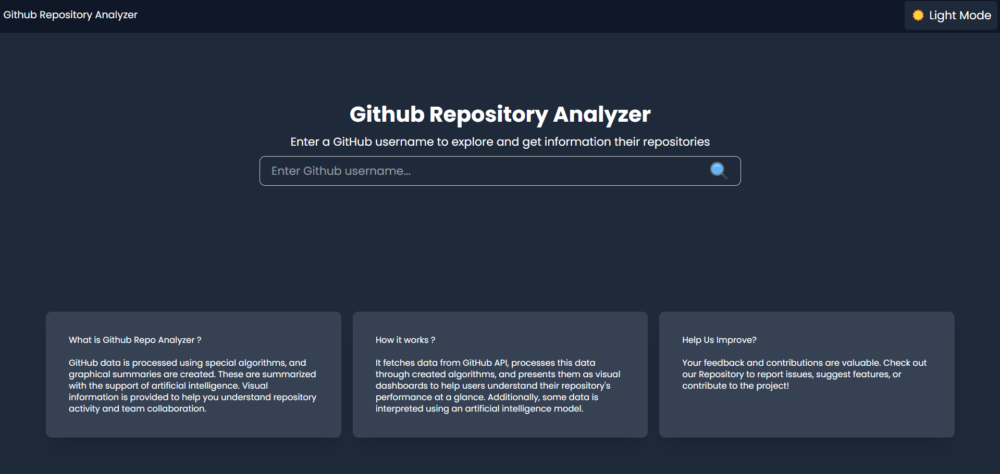
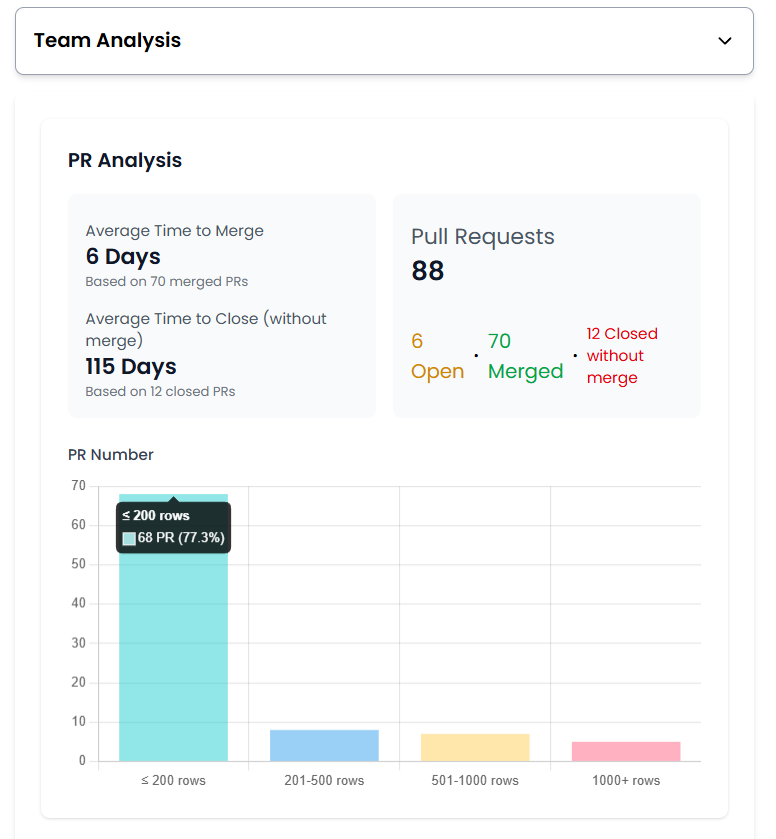
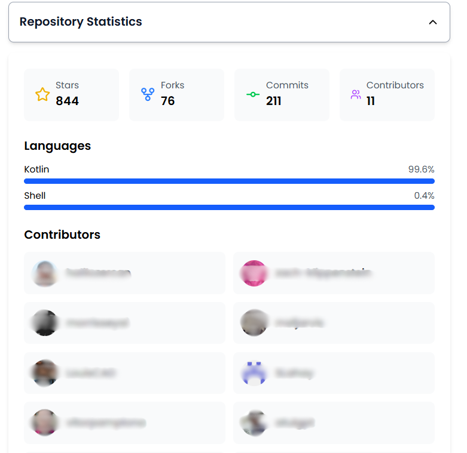
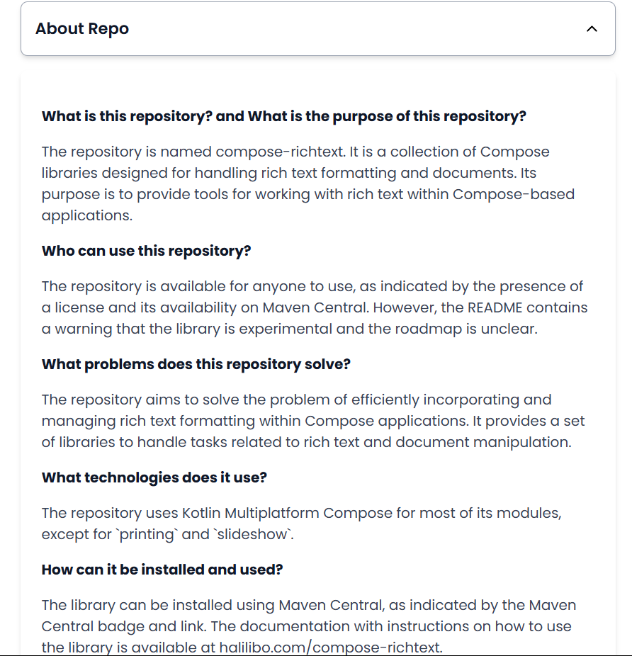
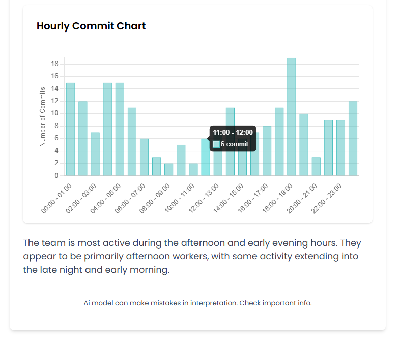

# Repository Overview

GitHub Repo Analyzer is a tool designed to provide detailed insights into GitHub repositories. It takes real-time data from the GitHub API and uses custom algorithms to create and visualize meaningful data. Some of this data is then analyzed by artificial intelligence to provide important insights and interpretations to the user.







## Features:
### ✨ Repository Description Analysis: 
The tool retrieves the repository’s README and, using Gemini AI, provides a summary of its key aspects. It identifies the repository’s purpose, target audience, and the main problems it solves. Additionally, it analyzes the technologies used, installation instructions, and the repository’s maintenance status. Warning signs like "Deprecated" or "Experimental" are flagged, along with license details if available. This helps users quickly understand and evaluate the repository's content, relevance, and reliability.
-  What is this repository?
-  Who can use this repository?
- What problems does it solve?
- Is it actively maintained?


### ✨ Team Analysis:
 Provides comprehensive insights into team activity, focusing on pull request (PR) and commit patterns:
 
 **PR Insights:**
*   Total number of pull requests with counts for open and closed PRs.
*   Average PR Closing Time: Helps gauge the speed of PR reviews and merges.

**PR Size Distribution (with charts):**

*   Under 200 lines: percentage and count.
*   201–500 lines: percentage and count.
*   501–1000 lines: percentage and count.
*   1000+ lines: percentage and count.

**Commit Activity:**

*   A visualized hourly breakdown of all commits, showing the number of commits made in each hour of the day.
*   Using AI model, the tool provides a summary of commit activity. For example:
   >  “The team appears to be most active during the afternoon and evening hours. They are primarily afternoon and evening workers, with activity ranging from mid-morning through late evening UTC.”

### ✨ Repository Overview:
*  Displays repository statistics such as stars, forks, total commits, contributors, and a breakdown of languages with percentages.

   


## Installation

Follow these steps to set up and run the application:

1.  **Clone and install:**
    ```bash
    git clone https://github.com/gzcmustafa/github-analytics-dashboard.git
    cd github-analytics-dashboard.git
    ```

2.  **Environment Variables:**  This application requires environment variables for accessing the GitHub API and Gemini AI. Create a `.env` file in the root directory of the project and add the following:

    ```
    VITE_GITHUB_TOKEN=YOUR_GITHUB_API_TOKEN
    VITE_GEMINI_TOKEN=YOUR_GEMINI_AI_API_KEY
    ```
    *   `GEMINI_API_KEY`: Your API key for the Gemini AI service. You can obtain this from the Google AI Studio.
    *   `GITHUB_API_TOKEN`: Your personal access token for the GitHub API. You can generate one on GitHub under Settings > Developer settings > Personal access tokens. When generating the token, ensure it has the following scopes for full functionality:
    
        *   **Full control of private repositories:**
            *   `repo`
            *   `repo:status` – Access commit status
            *   `repo_deployment` – Access deployment status
            *   `public_repo` – Access public repositories
            *   `repo:invite` – Access repository invitations
            *   `security_events` – Read and write security events
        *   **Organization Access:**
            *   `read:org` – Read organization and team membership, read organization projects
        *   **User Profile Access:**
            *   `read:user` – Read all user profile data
    

3.  **Install dependencies:**
    ```bash
    npm install
    ```

4.  **Run the Application:**
    ```bash
    start
    ```

## About the Gemini AI Model

This project uses the **Gemini 2.0 Flash Experimental** model for AI-powered analysis and summarization.  Here's a brief overview:

*   **Model Name:** `gemini-2.0-flash-exp`
*   **Use Cases:** Best suited for multimodal understanding, multimodal generation, and native tool use (e.g., calling Search, generating interleaved text and images). Useful for processing large amounts of code (e.g., 10,000 lines).
*   **Knowledge Cutoff:** August 2024
*   **Pricing (as of this update):**
    *   Input:  $0.00 for <=128K tokens; $0.00 for > 128K tokens
    *   Output: $0.00 for <=128K tokens; $0.00 for > 128K tokens
    *   **Currently FREE:** The Gemini 2.0 Flash Experimental model is currently offered free of charge but this might change in the future. Please refer to the Google AI Studio documentation for the latest pricing details.
*   **Rate Limits:** 10 RPM (Requests Per Minute), 1500 requests per day.

**Important Considerations:**

*   This model is experimental.  Expect potential changes in its behavior and features.
*   Always refer to the official Gemini AI documentation for the most up-to-date information on pricing, rate limits, and model capabilities.